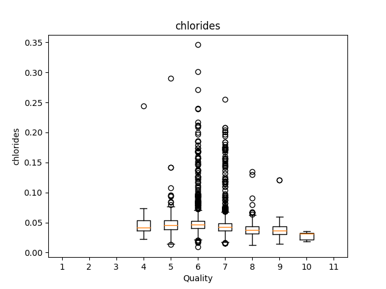
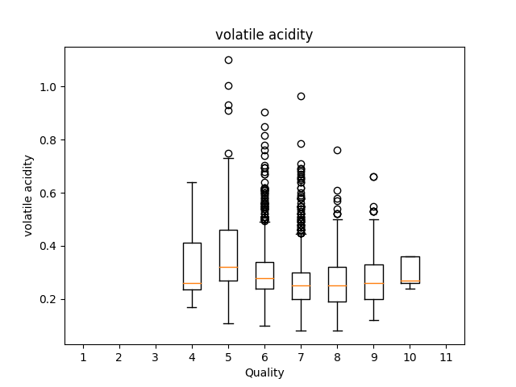

# Python Wine Classifier

    
    

This program is to test Pandas, with simple machine learning of wine quality.

# Dataset

The dataset, additional metadata, and the .csv files used in this program can be found at:
https://archive.ics.uci.edu/dataset/186/wine+quality

# Contribution 

If you'd like to contribute to `python_wine_classifier` please submit a pull-request on a feature branch.

# Installing

Clone the repo:

    git clone https://github.com/Sommos/python_wine_classifier

    cd python_wine_classifier